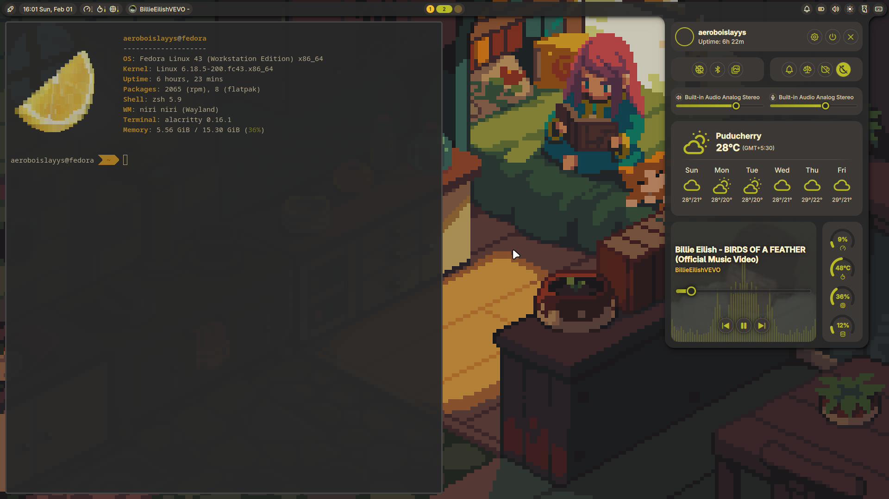

# 🍋 Lemon Niri Dotfiles



My custom Wayland desktop environment featuring a bold yellow **"Citrus"** aesthetic and proportional tiling powered by **Niri**.

Minimal. Bright. Functional.

---

## 📸 Preview

> [!TIP]
> This setup uses `fastfetch` with a custom lemon graphic rendered via `chafa` for that signature look.

---

# 🚀 Installation

## ✅ Recommended: Manual Installation

Manual installation is strongly recommended so you:

- Understand every change being made
- Control your backups
- Avoid unexpected package conflicts
- Learn how your environment is structured

---

### 1️⃣ Install Dependencies

Install the core packages using your distro’s package manager.

**Arch Linux**
```bash
sudo pacman -S --needed niri waybar foot mako fuzzel swww git
```

**Fedora**
```bash
sudo dnf install niri waybar foot mako fuzzel swww git
```

**Ubuntu / Debian / Pop!_OS**
```bash
sudo apt update
sudo apt install niri waybar foot mako fuzzel swww git
```

> Adjust package names if needed for your distro.

---

### 2️⃣ Clone Repository

```bash
git clone https://github.com/aeroslayys/niri-dotfiles ~/niri-dotfiles
```

---

### 3️⃣ Backup Existing Configs (Important)

```bash
mkdir -p ~/dotfiles_backup
mv ~/.config/<folder> ~/dotfiles_backup/
```

---

### 4️⃣ Symlink Configurations

```bash
mkdir -p ~/.config
ln -sf ~/niri-dotfiles/<folder> ~/.config/
```

Repeat for each configuration directory you want to use.

---

## ⚠️ Auto Installer (Use at Your Own Risk)

An automated installer script is included for convenience.

⚠️ **This script makes system changes automatically.**
⚠️ **You are responsible for reviewing it before running.**
⚠️ **Manual installation is preferred.**

---

### Dry Run (Recommended First)

```bash
bash <(curl -sSL https://raw.githubusercontent.com/aeroslayys/niri-dotfiles/main/install.sh) --dry-run
```

---

### Execute Installer

```bash
bash <(curl -sSL https://raw.githubusercontent.com/aeroslayys/niri-dotfiles/main/install.sh)
```

---

## 🧠 What the Auto Installer Does

- Detects distro via `/etc/os-release`
- Selects correct package manager (`pacman`, `dnf`, `apt`)
- Prompts for optional components
- Installs selected packages
- Clones repo if missing
- Backs up existing configs
- Symlinks all directories automatically

Backups are stored in:

```
~/dotfiles_backup_YYYYMMDD_HHMMSS
```

---

## 🛠️ Components

| Category        | Tool        |
|----------------|------------|
| Compositor     | Niri       |
| Status Bar     | Waybar     |
| Terminal       | Foot       |
| Notifications  | Mako       |
| Launcher       | Fuzzel     |
| Wallpaper      | Swww       |

---

## ⚙️ Key Specs

- **Window Ratio:** 0.5 default column width  
- **Theme:** High-contrast yellow accents  
- **Font:** JetBrains Mono Nerd Font  

---

## 🍋 Philosophy

This setup is intentionally minimal and readable, built around:

- Proportional tiling
- High-contrast accents
- Clean terminal workflow
- Fast startup

---

Enjoy your Citrus-powered Wayland setup 🍋
