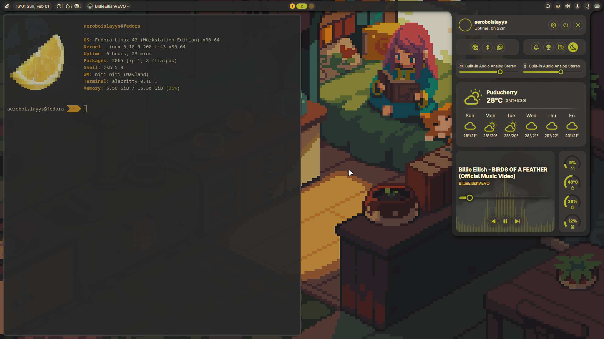
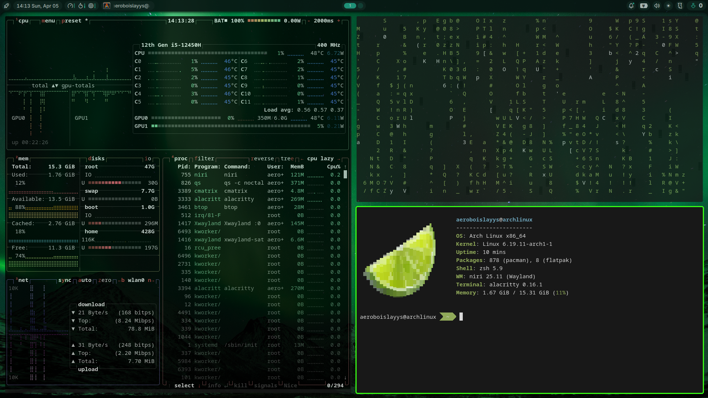
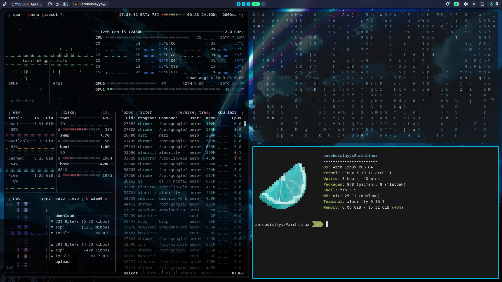

# 🍋 Lemon Niri Installer

A citrus-themed Wayland desktop installer built around **Niri** — featuring proportional tiling, bold accent colors, and a fully interactive terminal UI.

Minimal. Bright. Functional.

---

# 🎨 Pick Your Flavor

Choose your accent color during installation:

| Flavor | Color | Hex |
|--------|-------|-----|
| 🍋 Lemon | Classic Yellow | `#FFED29` |
| 🍈 Lime | Fresh Green | `#32CD32` |
| 🫐 Blue | Blue Lemonade | `#00B4D8` |

### 🍋 Lemon


### 🍈 Lime


### 🫐 Blue


---

# 🧠 What Makes This Installer Different

✔ Fully interactive **custom TUI (no dependencies)**  
✔ Keyboard-driven navigation (`j/k`, arrows, space, enter)  
✔ Safe config replacement with automatic backups  
✔ Theme injection based on selected flavor  
✔ Cross-distro support  
✔ `--dry-run` preview mode  

---

# 🚀 Installation

## 📦 Clone & Run (Recommended)

```bash
git clone https://github.com/aeroslayys/lemon-niri-installer ~/lemon-niri-installer
cd ~/lemon-niri-installer

chmod +x install.sh
./install.sh
```

---

## 🧪 Dry Run Mode (Safe Preview)

```bash
./install.sh --dry-run
```

Shows everything the installer *would* do without making changes.

---

## 🌐 One-Line Install (Optional)

Dry-run:

```bash
bash <(curl -sSL https://gist.githubusercontent.com/aeroslayys/48301affed815e0ed09d492c48f3322a/raw/install.sh) --dry-run
```

Run:

```bash
bash <(curl -sSL https://gist.githubusercontent.com/aeroslayys/48301affed815e0ed09d492c48f3322a/raw/install.sh)
```

---

# ⚙️ Supported Systems

| Distro | Status |
|--------|--------|
| Fedora | ✅ Fully supported |
| Arch Linux | ✅ Fully supported |
| Ubuntu / Debian | ⚠ Experimental |

### Notes
- Debian/Ubuntu installs **Niri via Cargo**
- Some components (like Noctalia) may require manual setup

---
## 🏔 Arch Linux & AUR Helpers

The installer is designed to be **AUR-helper agnostic**.

It will prioritize existing helpers such as:

- `yay`
- `paru`
- `aurutils`

If none of these are detected, the installer will automatically install `yay` to complete the environment setup.

This ensures a smooth experience while respecting existing Arch workflows.

---
# 🎮 Interactive Installer

## 1️⃣ Flavor Selection

Choose one:

- 🍋 Lemon  
- 🍈 Lime  
- 🫐 Blue  

---

## 2️⃣ Component Selection

Toggle what you want:

- Niri (Compositor)
- Noctalia (Status Bar)
- Bibata Cursor
- Tools (Fuzzel, Alacritty, Fastfetch, Chafa)
- Zsh + Oh My Zsh
- Wallpapers (~1GB, optional)
- Symlinks & Theming

---

## ⌨ Controls

| Key | Action |
|-----|--------|
| `j` / `↓` | Move down |
| `k` / `↑` | Move up |
| `SPACE` | Toggle selection |
| `ENTER` | Confirm |
| `e` | Exit installer |

---

# ⚙️ What the Installer Does

## ✔ Distro Detection

Uses `/etc/os-release`:

- Fedora → `dnf`
- Arch → `pacman` + AUR helper
- Debian/Ubuntu → `apt` + Cargo

---

## ✔ Automatic Bootstrapping

Installs if missing:

- `git`
- `curl`
- build tools (Debian-based)

---

## ✔ Smart Package Handling

### Niri
- Fedora → COPR (`yalter/niri-git`)
- Arch → `niri-git` (AUR)
- Debian/Ubuntu → installed via `cargo`

### Noctalia
- Fedora → Terra repo
- Arch → AUR
- Debian → manual build warning

---

## ✔ Tools Installed

- `alacritty`
- `fuzzel`
- `fastfetch`
- `chafa`
- `bibata cursor`

---

## ✔ Dotfiles & Config Management

- Clones repo → `~/lemon-niri-installer`
- Creates backup:

```
~/dotfiles_backup_YYYYMMDD_HHMMSS
```

- Replaces configs:
  - `niri`
  - `alacritty`
  - `fastfetch` *(stored as `fasfetch` in repo)*

- Replaces `.zshrc` if selected

---

## 🎨 Theme Injection

Automatically updates based on selected flavor:

- Zsh prompt colors  
- Fastfetch logo & colors  
- Niri active border color  

No manual editing required.

---

## 🖼 Wallpaper Pack (Optional)

- Source: JaKooLit Wallpaper Bank  
- Size: ~1GB  
- Installed to:

```
~/Pictures/Wallpaper-Bank
```

---

## 🧊 Virtual Machine Detection

If running in VirtualBox, installer suggests:

### Fedora
```bash
sudo dnf install virtualbox-guest-additions
```

### Arch
```bash
sudo pacman -S virtualbox-guest-utils
```

---

# 🛠 Components Overview

| Category      | Tool              |
|--------------|-------------------|
| Compositor   | Niri              |
| Terminal     | Alacritty         |
| Status Bar   | Noctalia          |
| Launcher     | Fuzzel            |
| System Info  | Fastfetch         |
| ASCII Render | Chafa             |
| Shell        | Zsh               |
| Cursor       | Bibata Modern Ice |

---

# ⚡ Key Specs

- **Layout:** Proportional tiling  
- **Default Ratio:** 0.5 column width  
- **Theme:** Citrus + Gruvbox-inspired contrast  
- **Bar:** Noctalia (GTK4)  
- **Installer:** Interactive TUI  

---

# 🍋 Philosophy

A clean, high-contrast Wayland setup focused on:

- Speed  
- Clarity  
- Minimalism  
- Visual identity  

---

# ⚠️ Important Notes

- Always review with `--dry-run`
- Debian-based support is experimental
- Existing configs will be backed up but replaced

---

# 🤝 Contributors & Credits

### Core Contributors

- **[@aeroslayys](https://github.com/aeroslayys)** — Creator, maintainer, and primary developer  

---

### Special Thanks

- **[Niri](https://github.com/niri-wm/niri)** — Wayland compositor  
- **[Noctalia](https://noctalia.dev/)** — GTK4 shell & bar  
- **[JaKooLit](https://github.com/JaKooLit)** — Wallpaper bank inspiration  
- **[Bibata Cursor](https://github.com/ful1e5/bibata)** — Cursor theme  

---

### Community

- Fedora & Arch Linux communities for ecosystem support  

---

Enjoy your Lemon Niri setup 🍋